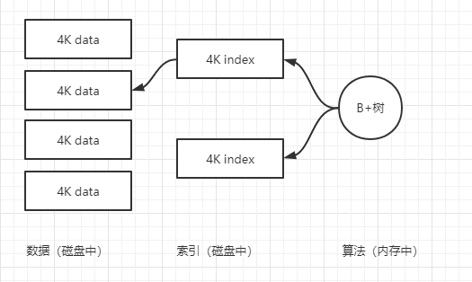

# Redis知识点

## 一、前景知识

1、常识：磁盘上寻址级别是ms，带宽G/M；内存寻址级别是ns，带宽很大；寻址相差10w倍。操作系统是以最少4k单位从磁盘中取数。

2、数据库将数据存在磁盘中，并维护索引，内存使用B+树。当一个查询sql进来，当where条件命中索引，那么B+树先将索引读取到内存中，查找出在哪块数据中存在，然后将这块数据加载到内存中，即可以找到对应的数据。

> 面试题：数据库的表很大，性能会不会下降？
>
> 答：如果表有索引，增删改操作会变慢，原因是需要维护索引；查询数据分为两种情况，1、一个或并发量少的情况，查询依然很快；2、并发大的情况下会受磁盘的带宽影响速度，原因是将多个4k数据加载到内存中，会影响到速度。

3、SAP HANA内存级别的关系型数据库。价格贵，容量有限。

## 二、缓存数据库：memcache redis

1、数据库引擎查询网址：https://db-engines.com/en/

2、redis官网：https://redis.io/；中文网：http://redis.cn/

3、redis是什么？

Redis 是一个开源（BSD许可）的，内存中的数据结构存储系统，它可以用作数据库、缓存和消息中间件。 它支持多种类型的数据结构，如 [字符串（strings）](http://redis.cn/topics/data-types-intro.html#strings)， [散列（hashes）](http://redis.cn/topics/data-types-intro.html#hashes)， [列表（lists）](http://redis.cn/topics/data-types-intro.html#lists)， [集合（sets）](http://redis.cn/topics/data-types-intro.html#sets)， [有序集合（sorted sets）](http://redis.cn/topics/data-types-intro.html#sorted-sets) 与范围查询， [bitmaps](http://redis.cn/topics/data-types-intro.html#bitmaps)， [hyperloglogs](http://redis.cn/topics/data-types-intro.html#hyperloglogs) 和 [地理空间（geospatial）](http://redis.cn/commands/geoadd.html) 索引半径查询。 Redis 内置了 [复制（replication）](http://redis.cn/topics/replication.html)，[LUA脚本（Lua scripting）](http://redis.cn/commands/eval.html)， [LRU驱动事件（LRU eviction）](http://redis.cn/topics/lru-cache.html)，[事务（transactions）](http://redis.cn/topics/transactions.html) 和不同级别的 [磁盘持久化（persistence）](http://redis.cn/topics/persistence.html)， 并通过 [Redis哨兵（Sentinel）](http://redis.cn/topics/sentinel.html)和自动 [分区（Cluster）](http://redis.cn/topics/cluster-tutorial.html)提供高可用性（high availability）。

4、memcache与redis的区别：

1）memcache的value没有类型的概念，redis是有的；

2）memcache会将所有的数据返回给客服端；（类型不是很重要）redis对每种类型都有自己的方法（如lpop、index等）去需要的数据即可（计算向数据移动）

## 三、redis基础知识

#### 1、redis安装过程

1）创建目录mkdir xxx

2）进入目录cd xxx

3）下载redis安装包wget xxx（网址）；若没有wget命令，则安装yum install wget

4）安装tar xf redis-xxx

5）进入目录 cd redis-xxx（可以阅读readme.md）

6）安装编译器yum install gcc（如果已安装，可跳过）

7）编译make（如果出错，可以使用make distclean）；编译完成后可以再src目录下执行./redis-server（手动启动）

8）配置成服务，安装make install PREFIX=/opt/redis5（目录）

9）配置环境变量vi /etc/profile；在文件最后export  REDIS_HOME=/opt/redis5；export PATH=$PATH:$REDIS_HOME/bin；退出执行加载文件source /etc/profile （echo $PATH查看配置文件）

10）进入cd utils，执行./install_server.sh（配置redis信息，可默认；后期可以使用service redis_6379 start[stop/status]）

#### 2、基础知识

redis默认有16个数据库（0~15），以及数据存储时存在正反向索引。redis数据是二进制安全的，以字节流形式保存数据

#### 3、reids常见命令

可参考：http://doc.redisfans.com/index.html

**key有关：**

| 命令                                 | 说明                                                         |
| ------------------------------------ | ------------------------------------------------------------ |
| del key [key ...]                    | 删除一个或多个key，不存在的key会被忽略。                     |
| dump key                             | 序列化给定的key，并返回值                                    |
| exists key                           | 判断key是否存在                                              |
| expire key seconds                   | 给key设置过期时间（秒为单位）成功返回1，失败0                |
| expireat key timestamp               | 给key设置过期时间戳（秒为单位），成功返回1，失败0            |
| keys pattern                         | *表示全部，？表示任意一个，[]表其中之一                      |
| move key db                          | 将当前数据库的key移动到给定的数据库中（0~15）                |
| persist key                          | 移除key的过期时间，成功返回1，失败0                          |
| pexpire key milliseconds             | 给key设置过期时间（毫秒为单位）成功返回1，失败0              |
| pexpireat key milliseconds-timestamp | 给key设置过期时间戳（毫秒为单位）成功返回1，失败0            |
| pttl key                             | 查看key的剩余过期时间（毫秒为单位），不存在key返回-2；key没有过期时间返回-1；否则返回剩余过期时间 |
| ttl key                              | 查看key的剩余过期时间（秒为单位），同上                      |
| randomkey                            | 返回随机一个key                                              |
| rename key newkey                    | 重命名key，当key不存在时，返回错误                           |
| renamenx key newkey                  | 重命名key，仅当newkey不存在时；成功返回1，newkey存在返回0，key不存在返回错误 |
| type key                             | 返回key的value类型，none（key不存在），string，list，set，zset，hash |
|                                      |                                                              |

**String有关：**

| 命令                                                  | 说明                                                         |
| ----------------------------------------------------- | ------------------------------------------------------------ |
| set key value [ex senonds] [px milliseconds] [NX\|XX] | 设置key-value数据，如果key存在则直接覆盖，ex/px表示过期时间，NX表示key不存在时，才能设置；XX表示key已存在，才能更新 |
| setex key seconds value                               | 设置key-value，并给key设置过期时间（秒为单位）               |
| setnx key value                                       | 设置key-value，仅当key不存在时。成功返回1，失败返回0         |
| get key                                               | 获取key的值，key不存在返回nil                                |
| getset key value                                      | 先获取key的值，再更新值；若key不存在，返回nil，此时相当于set |
| append key value                                      | 在key的值上追加vlaue；key不存在，则相对于set                 |
| setbit key offset value                               | 对key的value设置或者清除指定位置上的位，value可以为0或1；当key不存在时，生产一个新的值，空位以0填充 |
| getbit key offset                                     | 获取key的value上指定位置上的位的值（0或1）；若key不存在，则为0 |
| bitcount key [start] [end]                            | 统计比特位为1的数量；若key不存在，返回0                      |
| incr key                                              | 将key中存储的vlaue加1；若key不存在，则key的值初始化为0，再加1 |
| incrby key                                            | 将key中存储的value减decrement；若key不存在，同上             |
| incrbyfloat key increment                             | 增加浮点值；若key不存在，同上；浮点数为负数时，就是减        |
| decr key                                              | 将key中存储的value减1；若key不存在，则key的值初始化为0，再减1 |
| decrby key decrement                                  | 将key中存储的value减decrement；若key不存在，同上             |
| getrange key start end                                | 截取字符串，范围start到end（两者包含）                       |
| mget key [key ...]                                    | 返回一个或多个给定的key值                                    |
| mset key value [key value ...]                        | 同时设置一个或者多个key-value                                |
| msetnx key value [key value ...]                      | 同时设置一个或者多个key-value；当只有一个key一存在，则全部失败，即该操作为原子性，要么全部成功，要么全部失败。 |
| psetex key milliseconds vlaue                         | 与setex相似，但是设置的时间以毫秒为单位                      |
| setrange key offset value                             | 从offset开始覆盖value的值                                    |
| strlen key                                            | 返回key的value字符串长度                                     |

**hash有关：**

| 命令                                    | 说明                                                |
| --------------------------------------- | --------------------------------------------------- |
| hdel key field [field...]               | 删除key中的一个或多个指定域；不存在，则忽略         |
| hexists key field                       | 判断key中是否存在给的field；有返回1，否则返回0      |
| hget key field                          | 获取key中给定域field的值                            |
| hgetall key                             | 获取key中所有的域或值                               |
| hincrby key field increment             | 为key中的filed域增量increment，可以是负数           |
| hincrbyfloat key field increment        | 为key中的filed域浮点值增量increment，可以是负数     |
| hkeys key                               | 返回key中所有域                                     |
| hlen key                                | 返回key中域的数量                                   |
| hmget key field [field...]              | 返回key中一个或多个指定域的值                       |
| hmset key field value [field value ...] | 同时设置一个或多个域值对到key中。已存在的域会被覆盖 |
| hset key field value                    | 设置key中一个field域的值                            |
| hestnx key field value                  | 新增key中field域的值，当field域存在时，则失败       |
| hvals key                               | 返回key中所有域的值（只是返回值）                   |

**list有关：**

| 命令                                  | 说明                                                         |
| ------------------------------------- | ------------------------------------------------------------ |
| blpop key [key...] timeout            | 阻塞式弹出头数据；当没有数据时， 命令阻塞，直到等待超时或发现可弹出元素为止。 |
| brpop key [key...] timeout            | 阻塞式弹出尾数据；当没有数据时， 命令阻塞，直到等待超时或发现可弹出元素为止。 |
| lindex key index                      | 返回key中下标为index的数据                                   |
| linsert key before\|after pivot value | 将value插入到key中，位于pivot之前或之后                      |
| llen key                              | 返回key的value长度                                           |
| lpop key                              | 移除并返回key的value头元素                                   |
| lpush key value [value...]            | 将一个或多个value插入到key的表头中                           |
| lpushx key value                      | 当key存在时，将value插入到key的表头中                        |
| lrange key start stop                 | 返回指定key的区间内元素                                      |
| lren key count value                  | 移除key中value相等的元素；当count大于0，从表头开始搜索；当count<0，从表尾开始搜索；等于0，表示移除所有。 |
| lset key index value                  | 将value插入到key的指定下标index位置                          |
| ltrim key start stop                  | 指定范围内的元素保留，不在区间内的删除掉                     |
| rpop key                              | 移除并返回key的value尾元素                                   |
| rpush key value [value...]            | 将一个或多个value插入到key的尾部                             |
| rpushx key value                      | 当key存在时，将value插入到key的表尾中                        |

**set有关：**

略（暂时不写了）

**sortedset有关：**

略（暂时不写了）

## 四、常见的应用场景

## 五、redis集群

1、单机、单节点、单实例存在的问题：单点故障、容量有限、压力

2、配置redis主从：

​	1）关闭后台运行：daemonize no

​	2）关闭日志：#logfile /var/log/redis_6379.log

​	3）redis主从设置两种方法：

​	第一种：命令实现主从  —> replicaof  host port

​					取消跟随 replicaof no one

​	第二种：修改配置文件

​		replica-serve-stale-data yes

​		replica-read-only yes

​		repl-diskless-sync no

​		repl-backlog-size 1mb：增量复制空间大小

​		min-replicas-to-write 3：

​		min-replicas-max-lag 10：

3、哨兵sentinel

